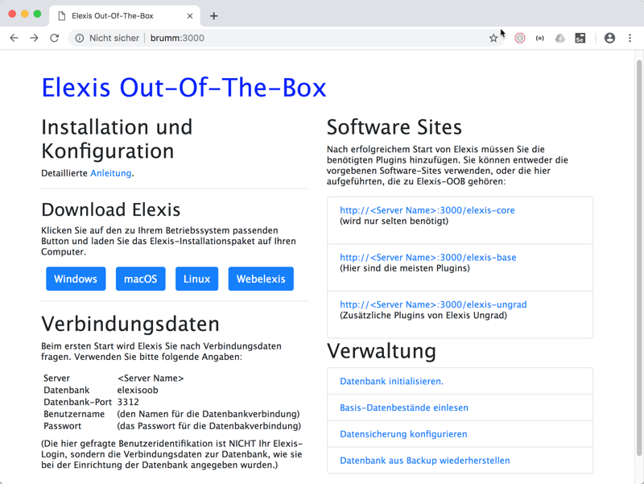

Elexis-OOB ist eine komplette [Elexis](http://elexis.ch)-Umgebung bestehend aus:

* MariaDB Server und Datenbank.
* Elexis-Clientprogrammen für Windows, macOS und Linux.
* Webelexis (Elexis Client für mobile Geräte)
* Lucinda (Dokumentenverwaltung)
* PACS (Bildverwaltung)
* Web-Oberfläche zur initialen Einrichtung des Systems, sowie Konfiguration, Erstellung und Zurückspielen von Backups.

Das Ganze ist als Docker - Komposition entworfen. Dadurch ist es (ziemlich) systemunabhängig und ausserordentlich leicht einzurichten. Im Prinzip genügt ein einziger docker-compose Befehl, um das System aufzusetzen, und danach einige Schritte für die Konfiguration. Damit ist Elexis-OOB ein System, mit dem Sie eine komplexe Arztpraxis-Software auf einfache Weise fast überall installieren können. Sei es als Test-Installation, sei es als produktive Praxissoftware. Sie können auch relativ leicht mehrere Instanzen parallel laufen lassen (Wobei dann natürlich gesteigerte Vorsicht angezeigt ist, um die produktive Instanz nicht mit einer Testinstanz zu verwechseln, und so Daten zu verlieren).

Diese Anleitung führt sie durch den [Installations](install.md)- und [Konfigurations](config.md)vorgang.

