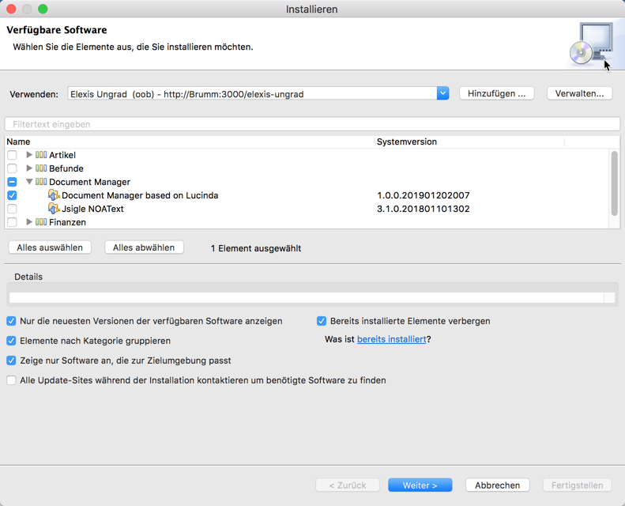
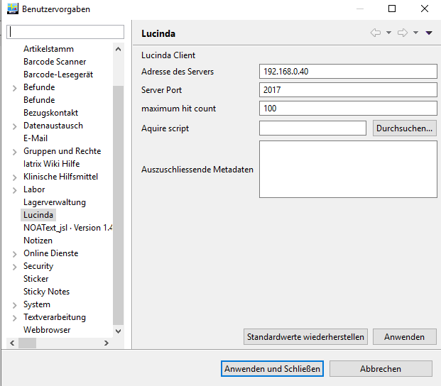

# Lucinda

Lucinda ist ein Dokumentenverwaltungssystem, welches mit Elexis-OOB bereits automatisch eingerichtet wurde. Ihr Elexis-Client kann über ein Plugin mit dem Lucinda-Server kommunizieren. Dieses Plugin müssen wir nun allerdings zunächst installieren. Es befindet sich im Repository "Elexis Ungrad", und es ist abhängig von einem weiteren Plugin: Omnivore.

Falls Sie bei der Einrichtung des [Elexis-Clients](elexis.md) nicht wie vorgeschlagen das Omnivore-Plugin installiert haben, müssen Sie das jetzt zunächst nachholen, damit das Lucinda-Plugin installiert werden kann.

Fügen Sie dazu das Ungrad-Repository hinzu, falls noch nicht geschehen.



Wählen Sie dann dort "Document Manager based on Lucinda" und klicken Sie "Weiter" und dann "fertigstellen". Starten Sie dann Elexis neu.


Nach dem Neustart müssen wir unter Datei-Einstellungen-Lucinda Ihren Arbeitsplatz mit dem Server bekannt machen. Gehen Sie dazu nach Datei->Einstellungen->Lucinda und geben Sie dort die passenden Zugriffsdaten ein:



Öffnen Sie dann die Lucinda-View und klicken Sie auf den roten Punkt, der sich grün färben wird, wenn die Verbindung erfolgreich war. 

Weiteres zur Konfiguration und Bedienung von Lucinda finden Sie [dort](https://elexis.ch/ungrad/features/lucinda/).


## Tips und Tricks


### Windows Computer

Bei Windows 7 taucht das Lucinda-Dokumentenverzeichnis üblicherweise direkt in der Netzwerkumbegung auf. Bei Windows 10 leider des Öfteren nicht. Sie können die Verbindung aber manuell herstellen. Öffnen Sie in Windows eine Kommandozeile (cmd.exe) und geben Sie dort ein:

```
net use L: \\<IhrServer>\lucinda
```
Sie finden das Lucinda-Dokumentenverzeichnis dann unter L: (Wobei Sie für L: natürlich auch einen anderen freien Laufwerksbuchstaben eingeben können)

Manchmal müssen Sie stattdessen Folgendes eingeben: 

```
net use L: \\elexisdata\lucinda
```

### Schreibrechte
Das Speichern von Dokumenten im Lucinda-Dokumentenverzeichnis funktioniert in der derzeitigen Version von Elexis-OOB noch nicht direkt. Man muss zuerst Schreibrechte gewähren:


```
docker exec -it elx_samba /bin/sh
chmod -R 777 /mnt/lucinda
exit
```
