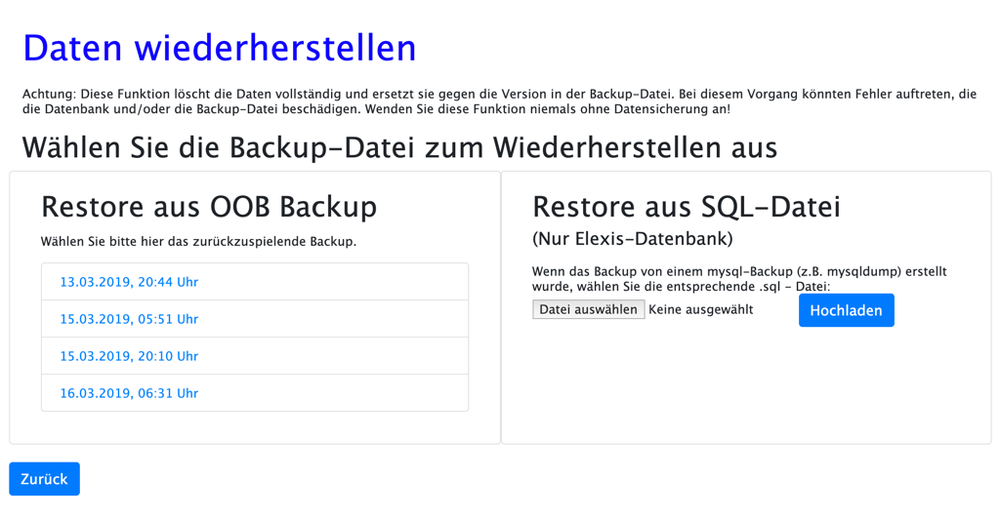
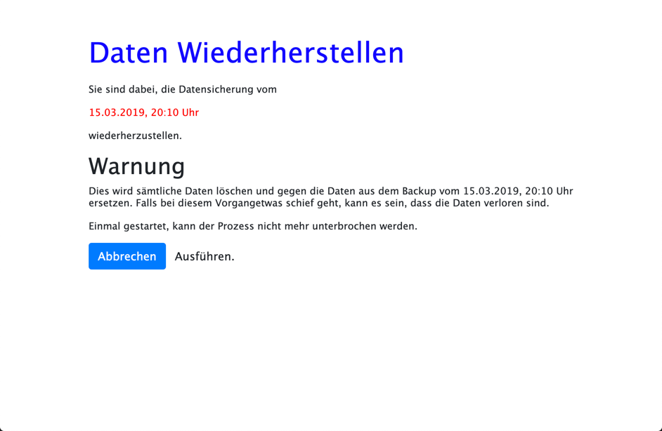
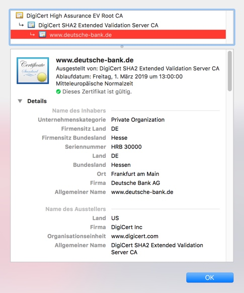
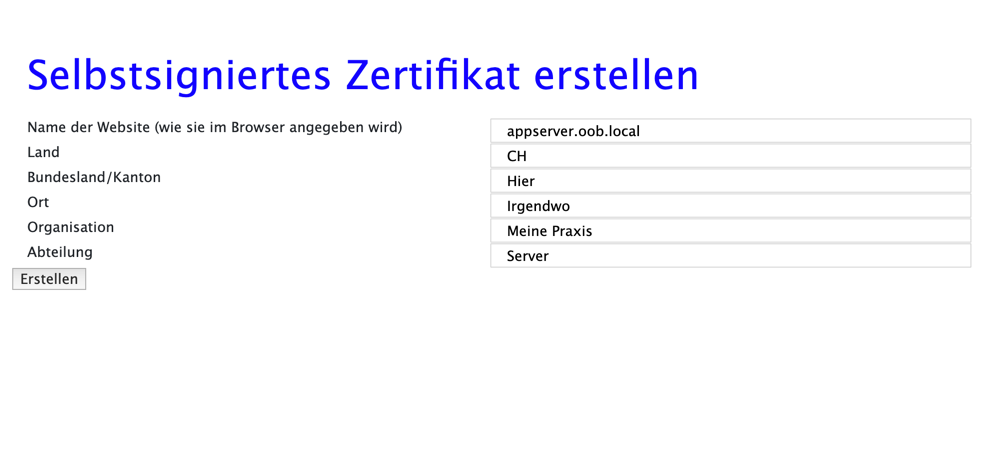
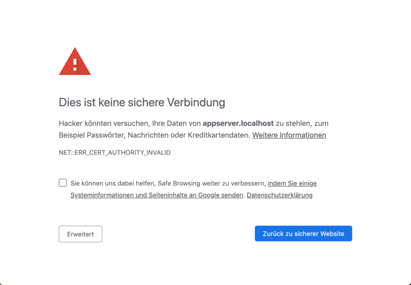
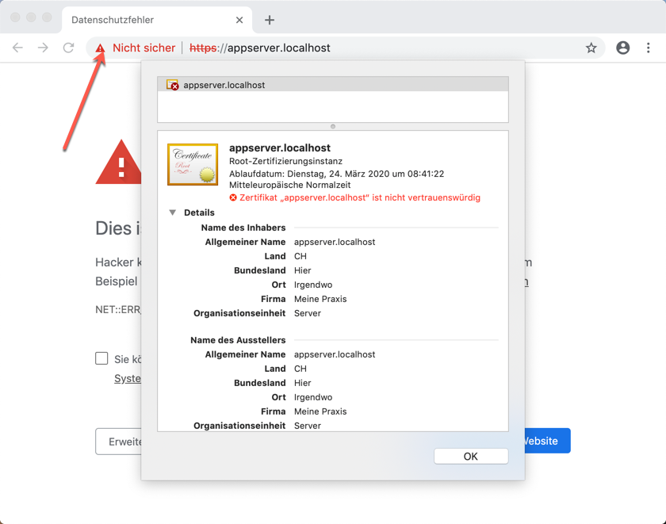
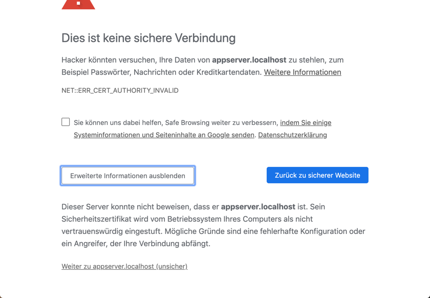
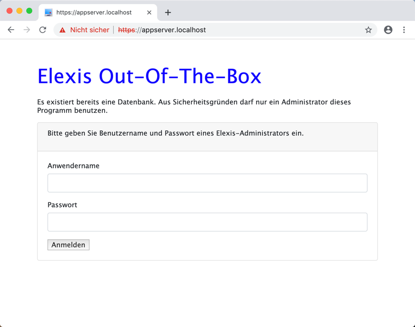

# Datenbank Verwaltungs Funktionen

Die Funktionen zum Einrichten der Datenbank und Einlesen von Datenbeständen haben wir ja bereits bei der [Ersteinrichtung](config.md) besprochen.

Elexis-OOB erlaubt Ihnen ausserdem, Sicherungen Ihrer Datenbank zu planen und wiederherzustellen.

*Achtung*: Sie sollten Ihre Datensicherung unbedingt in regelmässigen Abständen testen, etwa mit einer zweiten Elexis-OBB-Instanz, damit Sie erkennen, falls etwas nicht funktioniert!


## Grundlagen

Zu grundsätzlichen Überlegungen zum Backup lesen Sie bitte [hier](backup.md)

Man kann eine Datenbank grundsätzlich auf zwei Arten sichern:

1: Man kann das Verzeichnis, in dem die Daten auf der Festplatte physisch gespeichert sind, komplett sichern.

Vorteile: 

* Relativ schnelles Sichern und Wiedereinspielen
* Kann im Rahmen eines standardmässigen System-Backup-Konzepts eingebunden werden

Nachteile:

* Funktioniert nur mit derselben Datenbank, oft sogar nur mit derselben Version des Datenbankservers unter demselben Betriebssystem wie beim Backup. Das kann beim Versuch, ein länger zurückliegendes Backup wieder einzulesen, unlösbare Probleme machen.
* Funktioniert nur zuverlässig, wenn das Datenbank-Serverprogramm zum Zeitpunkt der Sicherung gestoppt ist, da sonst Inkonistenzen auftreten können (Wenn die Datenbank ein Objekt verändert, das gerade geichert wird.) Inkonistenzen bei der Sicherung können dazu führen, dass ein Wiedereinspielen unmöglich ist.


2: Man speichert das Backup als Folge von SQL-Befehlen (SQL-Script)

Das ist quasi die Simulation aller Vorgänge die auf die Datenbank von Anfang an bis zum derzeitigen Stand angewendet wurden.

Vorteile:

* Funktioniert meistens auch zwischen verschiedenen Versionen des Datenbankservers und sogar betriebsytemübergreifend: Sie können das backup Ihres Linux-servers auf Ihrem Windows-Laptop testen.
* Bei allfälligen Fehlern können SQL-Scripts, die im Grunde einfache Textdateien sind, zur Not sogar manuell korrigiert werden.

Nachteile:

* Diese Dateien sind grösser, als reine Kopien. Sowohl ihre Erstellung als auch das Wiedereinspielen dauert wesentlich länger.

Elexis OOB verwendet die erste Möglichkeit. Allerdings kann es systembedingt den Datenbankserver nicht stoppen. Sie sollten also den Zeitpunkt des Backups so legen, dass dann sicher keine Aktivität stattfindet. Und ich würde empfehlen, zusätzlich noch ein Backup nach der Methode 2 ausserhalb von Elexis-OOB anzulegen. Auf der [Backup-Seite](backup.md) finden Sie Beispiel-Skripte.

## Ausführung

Wählen Sie im Elexia-OOB Hauptbildschirm im Feld "Verwaltung" den Punkt "Datenicherung konfigurieren". Folgendes Fenster erscheint:


Die Angaben, die Sie hier eintragem können, sind im "crontab" Stil. Die Einstellungen in diesem Beispielbild bedeuten: Es wird Montag bis Freitag jede Nacht ab 03:15 Uhr ein Backup erstellt. Für jedes der Felder können Sie folgende Ausdrücke angeben:

* Ein Stern, **\***: Jede. Also jede Minute, jede Stunde, jeden Tag. 
* Eine Zahl, z.B. **5**: Immer die 5. Minute oder die 5. Stunde, der 5. des Monats, jeden Mai oder jeden Donnerstag. Achtung: Immer die 5. Minute ist *nicht* dasselbe wie "alle 5 Minuten". Immer die 5. Minute bedeutet: 5 nach Mitternacht, 5 nach 1, 5 nach 2 usw.
* Mehrere durch Komma getrennte Zahlen, z.B. **1,3,4** Jeweils die erste,dritte und vierte Minute/Stunde/Tag/Monat/Wochentag.
* Zwei durch Bindestrich verbundene Zahlen, z.B. **1-5** würde bei der Angabe zum Wochentag z.B. bedeuten: Jeden Tag Montag bis Freitag.
* Stern und Schrägstrich, z.B. **\*/10** meint "alle 10", also etwa alle 10 Minuten, alle 10 Stunden usw.

Dies sollte für den Alltag genügen. Falls Sie es noch genauer wissen wollen, können Sie bei Seiten, die sich mit cron oder der [crontab](https://www.linuxwiki.de/crontab) befassen, weiter lesen.

Als letztes Feld sollten Sie noch angeben, wie viele Generationen von Backups aufbewahrt werden sollen. Der Platz auf Ihrem primären Backupmedium wird begrenzt sein, und diese Datensicherungen können mit der Zeit sehr gross werden. Geben Sie hier z.B. 10 an, um jeweils nur die 10 neuesten Sicherungen aufzubewahren (zumindest einige von den Älteren sollten Sie zu diesem Zeitpunkt schon durch ein Stufe-2-Backup irgendwo anders hin gesichert haben).

Beachten Sie, dass von jedem Datentyp die genannte Zahl aufbewahrt wird. Also 10 Datenbanksicherungen, 10 Lucinda-Sicherungen, 10 PACS-Sicherungen usw.

## Ergebnis

Zum  Verständnis, *wo* diese Backups eigentlich landen, und was man dann damit tun kann, ist leider ein Verständnis der Docker-Interna notwendig. Standardmässig gehen die Backups in das Volume 'backup', das sich auf Linux Conputern in `/var/lib/docker/volumes/elexis-oob_backup` befindet. Sie können durch enstprechende Änderung der docker-compose.yaml ein anderes Backup-Verzeichnis anlegen. Wenn Sie zum Beispiel Backups auf das Laufwerk /mnt/grosseplatte schreiben wollen, dann müssten Sie den Abschnitt:


````yaml
appserver:
    build: ./appserver
    container_name: elx_appserver
    environment:
      - DBHOST=elexisdb
      - DBPORT=3306
      - PUBLIC_DBPORT=3312
      - HOST_HOSTNAME=<Server Name>
    volumes:
      - backup:/backup
      - webelexisdata:/mnt/webelexisdata
      - elexisdb:/mnt/elexisdb:ro
      - lucindadata:/mnt/lucindadata:ro
      - lucindabase:/mnt/lucindabase:ro
      - pacsdata:/mnt/pacsdata:ro
    restart: always  
    ports:
      - 3000:3000
    depends_on:
      - elexisdb
    labels: 
      - "traefik.frontend.rule=Host:elexisapps.docker.localhost"  
````

so ändern, dass in volumes steht:

````yaml
volumes:
      - /mnt/grosseplatte:/backup
      - webelexisdata:/mnt/webelexisdata
      - elexisdb:/mnt/elexisdb:ro
      - lucindadata:/mnt/lucindadata:ro
      - lucindabase:/mnt/lucindabase:ro
      - pacsdata:/mnt/pacsdata:ro
    
````
und dann das System mit `docker-compose restart` neu starten.

Die Backups sind komprimierte Dateien mit Namen wie: `elexisdb_YYYY-MM-DD-HHmm.tar.gz`.
 
## Wiederherstellung aus Backups

Um ein mit Elexis-OOB erstelltes Stufe-1-Backup wiederherzustellen, gehen Sie so vor:

Wählen Sie im Elexis-OOB Hauptfenster rechts unten die Option 'Daten aus Backup wiederherstellen':



Im linken Feld sehen Sie alle mit OOB erstellten Backups, im rechten Feld haben Sie ausserdem die Möglichkeit, die Elexis-Datanbank (und nur die) aus einer SQL-Datei wiederherzustellen, wie sie zum Beispiel mit dem Programm mysqldump erstellt wurde.

Wir beschränken uns hier auf die OOB Backups. Wenn Sie eines der gezeigten Backups anklicken, erscheint das folgende Bild:



Nehmen Sie diese Warnung durchaus ernst. Beim Wiederherstellen werden zunächst alle existierenden Daten gelöscht und dann die Daten aus dem Backup dorthin geschrieben. Genäss Murphy sind immer dann die Backup-Daten defekt, wenn man sie dringend braucht und keine Alternative hat.

Grundsätzlich sollten Sie sich ein von Elexis-OOB unabhängiges Backup-System einrichten lassen und parallel auch dieses nutzen. Denken Sie daran, dass Ihnen niemand garantieren wird, dass ein bestimmtes Datensicherungssystem im Ernstfall auch funktioniert (auch ich garantiere nichts). Sie sollten jedes Backup-System hin und wieder testen, indem sie Sicherungen auf eine andere Elexis-OOB-Instanz einspielen und ausprobieren, ob dort dann alles funktioniert.

Als mindest-Vorsichtsmassnahme würde ich kontrollieren, ob auf dem backup-Laufwerk noch genügend Platz frei ist, dann noch einmal ein Backup von den aktuellen Daten erstellen, dabei genau auf allfällige Fehlermeldungen achten, und erst dann das gewünschte Backup einspielen. 

Ausserdem sollten Sie unbedingt sämtliche Elexis- und Webelexis-Clients im Netzwerk stoppen.

Der restore-Prozess kann einige Zeit dauern.

## TLS/SSL Verbindung

Standardmässig ist die Verbindung zwischen den einzelnen Services und die Verbindung zwischen den Elexis Clients und der Datenbank unverschlüsselt. An sich ist das nicht unbedingt ein Problem, wenn die Kommunikation ausschliesslich in einem privaten und abgesicherten Netzwerk stattfindet: LAN Kabel sind bauartbedingt kaum abzuhören und richtig konfiguriertes WLAN ist per se bereits sicher verschlüsselt. 

Sobald allerdings Zugriff von aussen möglich ist, oder wenn das LAN nicht unter der alleinigen Kontrolle des Praxisinhabers ist, muss der Datenverkehr verschlüsselt werden. Dafür hat sich bereits 1995 ein Protokoll namens SSL (Secure Socker Layer) etabliert, das ab 1999 allmählich von TLS (Transport Layer Security) abgelöst wurde. Trotzdem sprechen viele noch von SSL, was auch nicht weiter schlimm ist, das Konzept der Protokolle ist dasselbe, nur die technische Implementation ist ein wenig unterschiedlich.

### Prinzip

Das Konzept basiert grundsätzlich auf dem Prinzip der asymmetrischen Verschlüsselung, das ursprünglich 1977 von Rivest, Shamir und Adleman entwickelt und nach ihren Anfangsbuchstaben RSA-Verfahren genannt wurde. Dabei hat man einen privaten Schlüssel, den man geheim hält und einen öffentlichen Schlüssel, der allgemein bekannt sein darf bzw. soll. Wenn nun Alphons eine Nachricht an Berta senden will, dann verschlüsselt er diese mit Bertas öffentlichem Schlüssel. Berta wiederum kann die Nachricht mit ihrem privaten Schlüssel entziffern. Eine zweite Möglichkeit ist folgende: Alphons kann seine Nachricht vor dem Verschlüsseln "signieren". Das bedeutet, er erstellt eine Prüfsumme über die Nachricht und verschlüsselt diese Prüfsumme mit seinem eigenen privaten Schküssel. Dann verschlüsselt er die Nachricht zusammen mit der Signatur mit Bertas öffentlichem Schlüssel. 

Diese entschlüsselt sie zunächst mit ihrem eigenen privaten Schlüssel und entschlüsselt anschliessend die Signatur mit Alphons' öffentlichem Schlüssel. Dann bildet sie selber eine Prüfsumme über die Nachricht und kontrolliert, ob diese Prüfsumme dieselbe ist wie das, was in der Signatur steht. Wenn ja, ist die Nachricht garantiert von Alphons - zumindest wenn sicher ist, dass der zur Prüfung verwendete öffentliche Schlüssel wirklich von Alphons stammt. 

Genau hier liegt eine Angreifbarkeit dieses Verfahrens: Wenn Cäsar die Nachrichten zwischen Alphons und Berta abhören will, dann kann er eine "Man in the middle attack" versuchen: Er generiert ein eigenes Schlüsselpaar, und jubelt beiden Partnern jeweils seinen öffentlichen Schlüssel unter. Dann kann er Alphons' Nachricht entschlüsseln, neu signieren und mit Bertas echtem öffentlichen Schlüssel an diese weiterleiten. Sie "meint" Alphons' öffentlichen Schlüssel zu habe, hat aber den von Cäsar und merkt so nicht, dass die Nachrichten abgehört oder sogar gefälscht werden.


### Implementation

Wenn ein Browser eine verschlüsselte Verbindung mit einem Webserver aufnehmen will, dann "spricht" er ihn mit https:// statt http:// an und wählt standardmässig den Port 443 statt 80. Zunächst verlangt er vom Server dessen öffentlichen Schlüssel, dann generiert er einen "session key", einen zufälligen Schlüssel für ein symmetrisches Verfahren, verschlüsselt diesen Schlüssel mit dem eben erhaltenen öffentlichen Schlüssel des Servers und schickt ihn zurück. Von da an kennen beide den session key, und die weitere Kommunikation wird mit diesem session key symmetrisch verschlüsselt. Dies deshalb, weil symmetrische Verfahren effizienter und schneller sind, als asymmetrische Verfahren - nur der Austausch des Schlüssels ist kritisch und dieses Problem hat die asymmetrische Verschlüsselung ja gelöst. 

Ich habe hier bewusst etwas vereinfacht: Client und Server müssen sich über verschiedene andere Dinge, zum Beispiel die zu verwendenden Verschlüsselungsalgorithmen, einigen. Etwas viel Wichtigeres habe ich aber auch weggelassen: Bei oben skizzierter Methode hat der Client keine Chance zu erkennen, wer der Server wirklich ist. Er könnte sich "meineBank.de" nennen, in Wirklichkeit aber zu "boeserhacker.com" gehören. Der öffentliche Schlüssel enthält per se keine nachprüfbare Identität. Dann würde die Kommunikation zwar perfekt verschlüsselt ablaufen, aber leider mit dem falschen Adressaten.

Dieses Problem wird mit Zertifikaten gelöst: Wenn eine vertrauenswürdige Stelle bestätigt, dass der öffentliche Schlüssel wirklich zu "meineBank.de" gehört, dann kann man das so weit glauben, wie man der Zertifizierungsstelle vertraut. Es gibt eine ganze Reihe solcher Zertifizierungsstellen, und die Browser- und Betriebssystemhersteller bemühen sich, deren Vertrauenswürdigkeit auf hohem Niveau zu halten. Ein Zertifikat kann zum Beispiel so aussehen (Sie erhalten es, wenn Sie im Browser bei einer https-Verbindung auf das Symbol links neben der Adresse klicken):


 
Hier bestätigt also DigiCert Inc, dass die Website www.deutsche-bank.de der Firma Deutsche Bank AG gehört, und dass der Server, mit dem ich derzeit verbunden bin, dieses Zertifikat besitzt: Der öffentliche Schlüssel, den diese https-Verbindung verwendet, wurde mit dem privaten Schlüssel von digicert Inc signiert, was mein Browser wiederum mit dem öffentlichen Schlüssel von Digicert prüfen kann (und er tut das auch jedesmal). Aber woher weiss ich, dass der öffentlich Schlüssel von Digicert wirklich Digicert Inc gehört? Ganz einfach: Der ist natürlich auch signiert. Von einer "höheren" Zertifizierungsstelle. Auf diese Weise kann man sich durch eine Kette von Zertifikaten (certificate chain) weiter hangeln, bis man ganz oben bei einem "root certificate"  angelangt ist. Und diese root-certificates sind fest im Browser gespeichert, können einem also nicht von Bösewichtern untergejubelt werden. Natürlich ist diese Zertifikatskette trotzdem ein Schwachpunkt des Ganzen. Es wurde zum Beispiel bekannt, dass manche Browser Root-Zertifikate eingebaut hatten, die unter Kontrolle der NSA standen, so dass diese jede Verschlüsselung kompromittieren konnte, indem sie sich für irgendeinen Server ausgab und dessen Zertifikat mit der eigenen Zertifizierungsstelle signierte.
Aber es ist immer noch die sicherste bekannte Möglichkeit, verschlüsselt und authentisiert zu kommunizieren. 
 
Wichtig ist auch zu wissen, dass die Zertifizierungsstelle nicht etwa die Schlüssel herstellt. Das tut man immer auf dem eigenen Computer, und der private Schlüssel sollte diesen nie verlassen. Man schickt nur den öffentlichen Schlüssel zum Signieren an die Zertifizierungsstelle. Dazu muss man dieser in irgendeiner, je nach Zertifikatstyp mehr oder weniger aufwändigen Form beweisen, dass man wirklich der Inhaber der zu schützenden Website ist. Also auch die Zertifizierungsstelle bekommt den privaten Schlüssel nicht zu Gesicht, kann die Verschlüsselung also nicht ohne Weiteres knacken.
 
In manchen Fällen genügt dieses Ein-Weg-Vertrauen nicht. Manchmal muss auch der Server genauer wissen, wer der Client ist. Dann kann er auch vom Client ein Zertifikat anfordern und überprüfen. Das ist aber nur selten der Fall. Meistens wird der Client einfach über eine Passwortabfrage authentisiert. 

## Verschlüsselung in Elexis OOB

Wie aus Obigem hervorgeht, ist das "Herstellen" eines Schlüsselpaars kein Problem. Damit sind alle Grundlagen gegeben, um Verschlüsselt zu kommunizieren. In Elexis-OOB können Sie für jeden Dienst ein eigenes Schlüsselpaar herstellen. Sie benötigen dazu nur einen eindeutigen Namen für den Dienst. Die Namen sind in der Datei .env im Wurzelverzeichnis von Elexis-OOB festelegt und lauten standardmässig:

* appserver.oob.local für den Anwendungsserver

* webelexis.oob.local für Webelexis

* lucinda.oob.local für das Dokumentnenverwaltungssystem Lucinda

* pacs.oob.local für das Bildverwaltungssystem PACS

* termine.oob.local für das Selbstbedieungs-Terminvergabemodul

Gehen Sie dann auf http://&lt;IhrServer&gt;:3000 und wählen Sie rechts unten im Abschnitt Verwaltung: "Selbstsigniertes Zertifikat erstellen".



Wichtig ist an sich nur die erste Zeile. Hier muss der Name des Dienstes so stehen, wie er später im Browser aufgerufen werden soll. Im Beispiel hgier gehen wir davon aus, dass der Elexis-OOB-Server unter dem Namen 'oob.local' im Netzwerk bekannt ist. Häufig ist das nicht der Fall, dann müssen Sie das anpassen, z.B. in 'appserver.brumm' oder 'appserver.&lt;IhrServerName&gt;'. Denselben Namen müssen Sie in der Datei .env in der Zeile APPSERVER_NAME eintragen.

Klicken Sie dann auf 'Erstellen' und gehen Sie für die anderen Dienste gleich vor. Danach müssen Sie OOB mit `docker-compose down --rmi local` und `docker-compose up -d`  neu starten. 

ACHTUNG: Es genügt <em>nicht</em>, einfach 'docker-compose restart' einzugeben, da die Container nicht nur neu gestartet, sondern mit den neuen Parametern neu erstellt werden müssen.

Nun können Sie mit `https://appserver.name` verschlüsselt auf den Dienst zugreifen. Allerdings ist der Browser noch immer nicht zufrieden. Je nachdem, welchen Browser Sie verwenden, wird die Warnung etwas anders aussehen. Bei Chrome ist es so:



Wenn Sie auf das Warnsymbol in der Titelzeile klicken, können Sie sich nähere Informationen zum Zertifikat anzeigen lassen:



Sie finden hier exakt die Angaben, die wir vorhin eingetragen haben (Und das ist der Grund, wieso man doch eher aussagekräftigere Angaben machen sollte, als ich in diesem Beispiel)

Wenn man links unten auf den Bitton "Erweitert" klickt, bekommt man dann doch noch eine Chance, zu der "unsicheren" Seite zu surfen:




Allerdings bleibt unser Server für Chrome höchst suspekt, wie man am roten "Nicht sicher" in der Titelseite sehen kann.



Wieso das so ist, sollte nach der Lektüre der Theorie weiter oben klar sein: Chrome kann nicht prüfen, ob das Zertifkat vertrauenswürdig ist, da es nicht von einer vertrauenswürdigen Zertifizierungsstelle signiert wurde (sondern nur von uns selbst). An der Qualität der Verschlüsselung ändert sich dadurch aber natürlich nichts. Die ist durch den Schlüssel gewährleistet, und der Schlüssel ist ja derselbe, egal ob wir ihn offiziell signieren lassen oder selbst signieren. Und da wir wissen, dass das Zertifikat echt ist - wir haben es ja vorhin selbst erstellt - können wir somit die Warnung getrost ignorieren.

## Vertrauenswürdige Zertifikate

Trotzdem ist es natürlich unschön, wenn wir jedesmal, wenn wir auf unseren eigenen Server zugreifen, den Browser beruhigen und überreden müssen, uns durchzulassen. Um dieses Problem zu umgehen, gint es verschiedene Möglichkeiten, die allerdings leider sehr verschieden je nach Betriebssystem und Browser sind. Einige Hinweise:

### Selbstsigniertem Zertifikat das Vertrauen aussprechen

* Manche Browser erlauben, Sicherheitsausnahmen dauerhaft zu speichern, und dann für dasselbe Zertifikat keine Warnung mehr auszugeben. 

* Bei manchen Betriebssystemen können Sie manuell das Vertrauen zu einem Zertifikat erklären (bei macOS zum Beispeil mit der Schlüsselverwaltung des Systems)

* Bei manchen Betriebssystemem können Sie auch manuell Root-Zertifikate installieren, mit denen Sie eigene Zertifikate signieren und damit das Vertrauen erklären können. Bei Ubuntu zum Beispiel müssen Sie dazu nur das eigene root-Zertifikat nach /usr/local/share/ca_certificates kopieren und dann eingeben `sudo update-ca-certificates`.

* Etwas ausführlichere Erläuterungen zu diesem Problemkreis finden Sie z.B. hier: <https://tarunlalwani.com/post/self-signed-certificates-trusting-them/>

### Offizielle Zertifikate erwerben/beziehen

Man kann natürlich auch den "offiziellen" Weg gehen. Und der sieht vor, dass man sich die Echtheit eines selbst erstellten Schlüssels von einer derjenigen Stellen zertifizieren lässt, die bei den Browsern bereits als vertrauenswürdig eingebaut sind, oder die selbst von solchen "root-certificastes" zertifiziert sind. Bis vor wenigen Jahren musste man dazu in die Tasche greifen: Zertifikate waren nur im Jahresabo zu haben und kosteten je nach Sicherheitsstufe von einer handvoll Dollars bis einigen hundert Dollars pro Jahr. Mit "Sicherheitsstufe" ist dabei gemeint, wie genau die Zertifizierungsstelle die Echtheit überprüft. Der Browser zeigt die Sicherheitsstufe eiunes Zertifikats durch die Art des Symbols in der Titelzeile an. Wobei noch einmal widderholt werden muss: Diese Sicherheitsstufe hat nichts mit der Sicherheit der Verschlüsselung zu tun, sondern nur mit der Sicherheit der Identität. In der niedrigesten Stufe muss man nur beweisen, dass man Administratorzugriff auf die  Website hat, die man sichern will, in der höchsten Stufe muss man der Zertifizierungsstelle z.B. einen Ausweis und einen Handelsregisterauszug vorweisen.

Seit einigen Jahren gibt es mit [Let's Encrypt](https://letsencrypt.org) eine Möglichkeit, kostenlos Zertifikate zu beziehen. Man muss dazu nur beweisen, dass man die Website. die man sichern will, manipulieren kann, Das lässt sich ohne weiteres automatisiert machen. Es gibt fertige Docker-Lösungen, die Let's Encrypt Zertifikate anfordern, verwalten und regelmässig erneuern können (Let's Enctypt Zertifikate sind immer nur 3 Monate lang gültig).

Voraussetzung ist natürlich, dass der Let's Encrypt Service die zu sichernde Website unter dem zu sichernden Domainnamen erreichen kann. Daher ist diese Lösung für reine Inhouse-Dienste nicht anwendbar.
