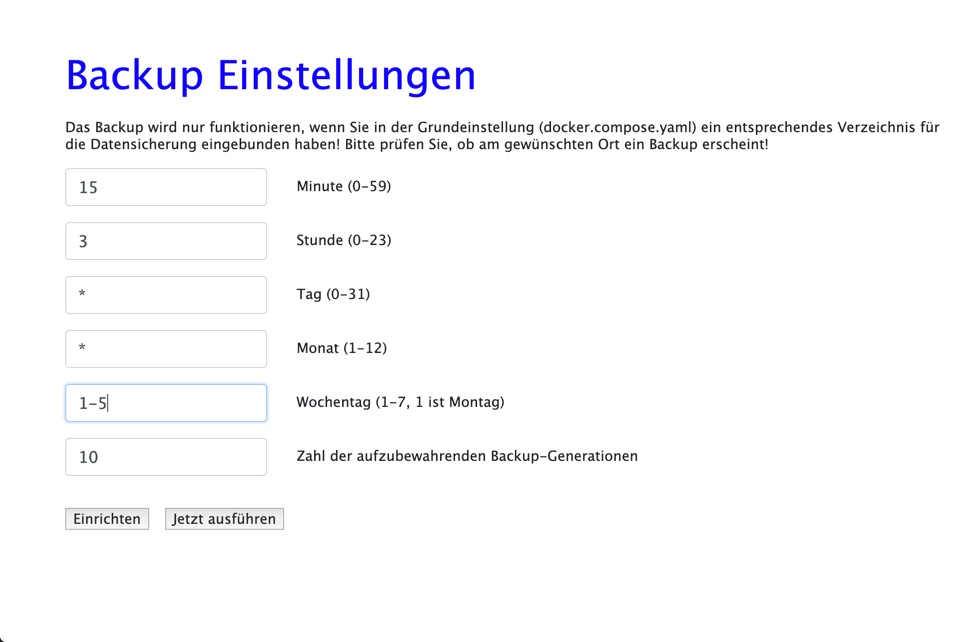

# Datenbank Verwaltungs Funktionen

Die Funktionen zum Einrichten der Datenbank und Einlesen von Datenbeständen haben wir ja bereits bei der [Ersteinrichtung](config.md) besprochen.

Elexis-OOB erlaubt Ihnen ausserdem, Sicherungen Ihrer Datenbank zu planen und wiederherzustellen.

*Achtung*: Sie sollten Ihre Datensicherung unbedingt in regelmässigen Abständne testen, etwa mit einer zweiten Elexis-OBB-Instanz, damit Sie erkennen, falls etwas nicht funktioniert!

## Grundlagen

Zu grundsätzlichen Überlegungen zum Backup lesen Sie bitte [hier](backup.md)

Man kann eine Datenbank grundsätzlich auf zwei Arten sichern:

1: Man kann das Verzeichnis, in dem die Daten auf der Festplatte physisch gespeichert sind, komplett sichern.

Vorteile: 

* Relativ schnelles Sichern und Wiedereinspielen
* Kann im Rahmen eines standardmässigen System-Backup-Konzepts eingebunden werden

Nachteile:

* Funktioniert nur mit derselben Datenbank, oft sogar nur mit derselben Version des Datenbankservers unter demselben Betriebssystem wie beim Backup. Das kann beim Versuch, ein länger zurückliegendes Backup wieder einzulesen, unlösbare Probleme machen.
* Funktioniert nur zuverlässig, wenn das Datenbank-Serverprogramm zum zeitpunkt der Sicherung gestoppt ist, da sonst Inkonistenzen auftreten können (Wenn die Datenbank ein Objekt verändert, das gerade geichert wird.) Inkonistenzen bei der Sicherung können dazu führen, dass ein Wiedereinspielen unmöglich ist.

2: Man speichert das Backup als Folge von SQL-Befehlen (SQL-Script)

Das ist quasi die Simulation aller Vorgänge die auf die Datenbank von Anfang an bis zum derzeitigen Stand angewendet wurden.

Vorteile:

* Funktioniert meistens auch zwischen verschiedenen Versionen des Datenbankservers und sogar betriebsytemübergreifend: Sie können das backup Ihres Linux-servers auf Ihrem Windows-Laptop testen.
* Bei allfälligen Fehlern können SQL-Scripts, die im Grunde einfache Textdateien sind, zur Not sogar manuell korrigiert werden.

Nachteile:

* Diese Dateien sind grösser, als reine Kopien. Sowohl ihre Erstellung als auch das Wiedereinspielen dauert wesentlich länger.

Elexis OOB lässt Ihnen beide Möglichkeiten.

## Ausführung

Wählen Sie im Elexia-OOB Hauptbildschirm im Feld "Verwaltung" den Punkt "Datenicherung konfigurieren". Folgendes Fenster erscheint:

Die Angaben, die Sie hier eintragem können, sind im "crontab" Stil. Die Einstellungen in diesem Beispielbild bedwuten: Es wird Montag bis Freitag jede Nacht ab 03:15 Uhr ein Backup erstellt. Zum  Verständnis, wo dieses Backup landet, und was man dann damit tun kann, ist leider ein Verständnis der Docker-Interna notwendig.